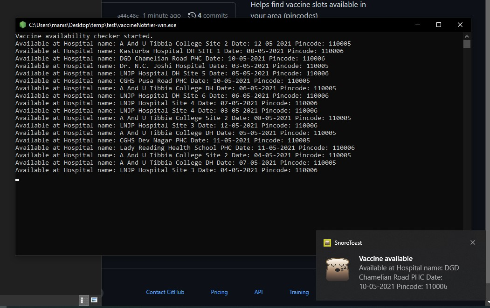

# Vaccine-Notifier
Helps find vaccine slots available in your area (pincodes)

How-TO:

1) Download the zip file <a href="https://github.com/manishsgaikwad/Vaccine-Notifier/blob/main/vaccineNotifier.zip?raw=true">Click Here</a>
2) Extract it in a folder  
3) Enter your age and pincodes in the ".env" file  
4) Run the "vaccineNotifier-win.exe" file  
5) You'll get a desktop notification whenever slots are open in the next 10 days starting from today's date

